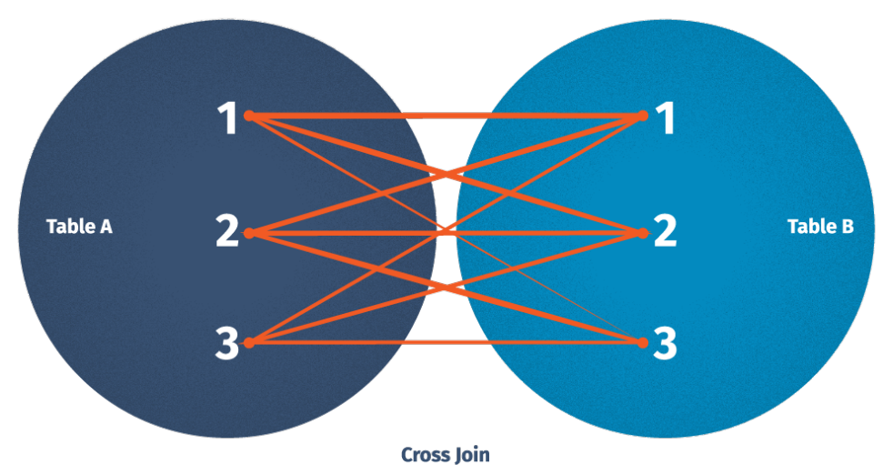
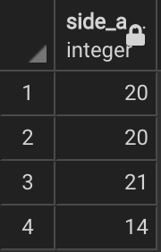
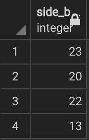

# RELATIONAL JOINS
### By
+ [`Fan Li`](https://github.com/victorlifan)
+ [`Kris Knapp`](https://github.com/kknapp3)
+ [`Vishwas Prabhu`](https://github.com/vishwasprabhu)

### Date created
2021/10/04

### Description
RDMS helps us to store and track records in a tidy way, but keeping all the data in a single table would hold tons of information making it hard to determine a row call and structure for various data. The real power of RDMS comes from working with data across multiple tables at once, allowing us to combine tables as needed to solve problems that require several types of data.

Leveraging SQL to link tables together is what we called ‘relational joins’. The term ‘relational’ refers to the fact that tables relate to each other by constrains and references. And join will let us merge columns together. In this project, we will demonstrate five major types of joins.

### Workflow:
5) Cross join

> Case:

    Given one side of a triangle is 40,
	how many different combinations are
	there in which we can form a triangle?

      
      

After running corss join query in [`relational_joins.sql`](https://github.com/vishwasprabhu/relational_joins/blob/main/relational_joins.sql). We will see first two columns, these are all possible pairs of two sides after we cross joining two tables. In this case we have 16 pairs with respect of the cartesian product rule. Third column is the summation of two sides and the the forth column is the conclusion, it indicates which summation > 40 (our given side_c). Here we can form 7 different triangles.

### Files
* [`reproducible_table_data.sql`](https://github.com/vishwasprabhu/relational_joins/blob/main/reproducible_table_data.sql): Run this to reproducible all the tables and data were used in this project.
* [`relational_joins.sql`](https://github.com/vishwasprabhu/relational_joins/blob/main/relational_joins.sql): Run this to see different joins results.

### Software used
+ PostgreSQL 14
> * pgAdmin4

### Credits
Venn diagrams were from: [`devart`](https://www.devart.com/dbforge/sql/sqlcomplete/sql-join-statements.html)
