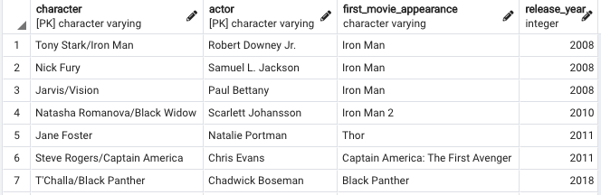
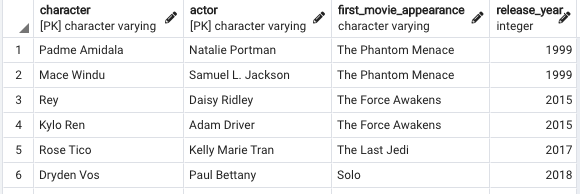
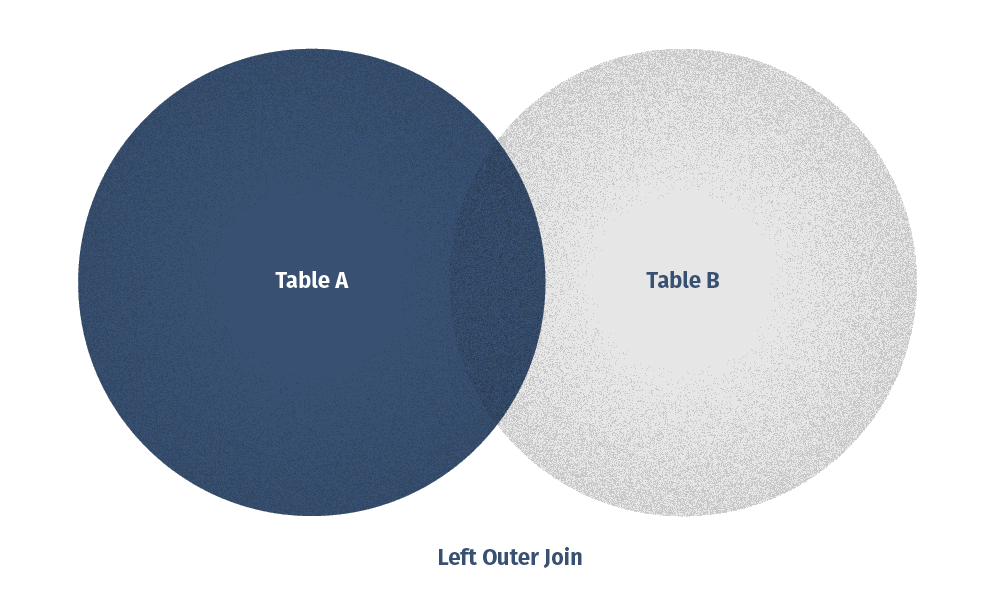
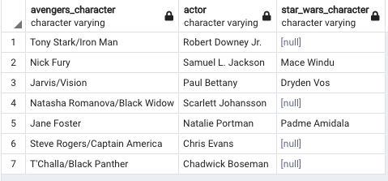
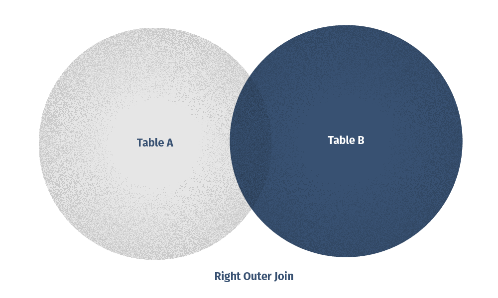
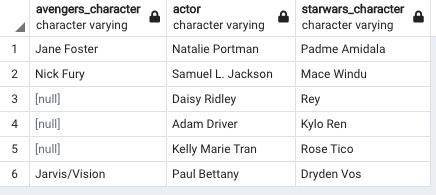
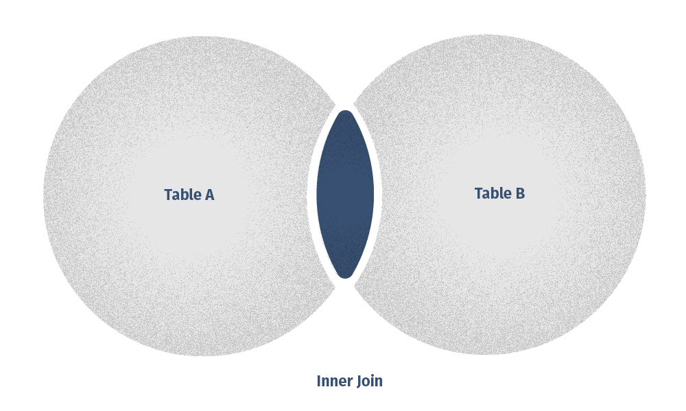
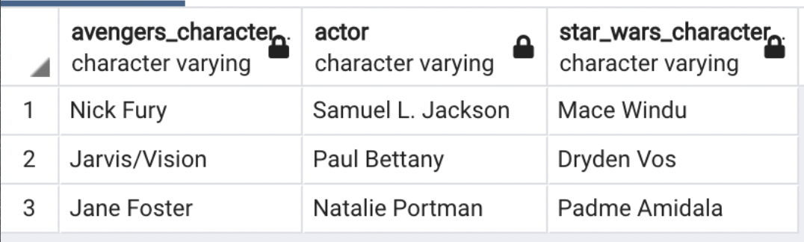
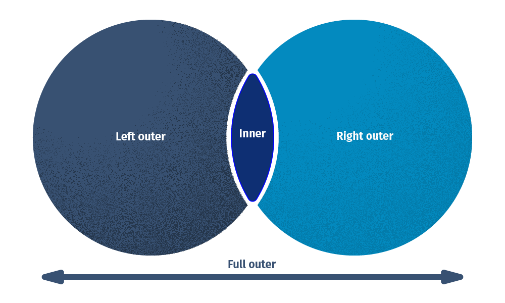
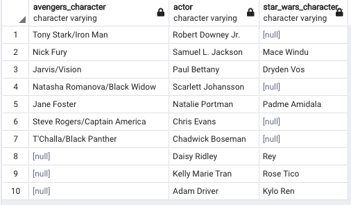

# RELATIONAL JOINS
### By
+ [`Fan Li`](https://github.com/victorlifan)
+ [`Kris Knapp`](https://github.com/kknapp3)
+ [`Vishwas Prabhu`](https://github.com/vishwasprabhu)

### Date created
2021/10/04

### Description
RDMS helps us to store and track records in a tidy way, but keeping all the data in a single table would hold tons of information, making it hard to determine a row call and structure for various data.  The real power of RDMS comes from working with data across multiple tables at once, allowing us to combine tables as needed to solve problems that require several types of data.

Leveraging SQL to link tables together is known as ‘relational joins’.  The term ‘relational’ refers to the fact that tables relate to each other by constraints and references.  And join allows us to merge columns together.  In this project, we will demonstrate five major types of joins.

### Data:
Using data available from https://www.imdb.com, a small SQL table named avengers was created, containing a limited amount of information on Avengers movies: 

  Similar information on Star Wars movies was also used to create a second table named star_wars: 

  SQL code to create and insert rows into these tables can be seen and run from the file  [`reproducible_table_data.sql`](https://github.com/vishwasprabhu/relational_joins/blob/main/reproducible_table_data.sql) here in this repository. 
Using various relational joins with the information in these tables, we hope to learn which actors who have starred in Avengers movies have also been cast in any Star Wars movies, and which have not. We would also like to view the question from the other side and see which actors who have starred in Star Wars movies have also been cast in any Avengers movies, and which have not.

### Workflow:
<h3> 1) Left join </h3>

> General Query syntax for Left join:

    SELECT a,b
    FROM left_table
    LEFT JOIN right_table
    ON left_table.a = right_table.b
 > Query for Left join on movie dataset:
    
    SELECT avengers.character AS avengers_character,
           avengers.actor AS actor,
	       star_wars.character AS star_wars_character
    FROM avengers 
    LEFT JOIN star_wars
    ON avengers.actor = star_wars.actor;
    

      

 

In general, a left join returns all rows from the left table, along with information from the right table which corresponds with any of the rows in the left table based on matching information in the columns mentioned in the ON clause.  So we get a full view of the information from the left table, plus the intersection operation between two tables and get the common data points as per the columns mentioned in the join condition. The rows returned would be the same set of rows in the left table, and thus will have an equal number of rows as the left table. 
After running the left join query in [`relational_joins.sql`](https://github.com/vishwasprabhu/relational_joins/blob/main/relational_joins.sql), the first column would display the character name in the Avengers movie, the second would display the actors name, and the third column the character name in the Star Wars movie, if applicable. Here, the rows comprise a list of actors who have acted in any Avengers movie and the character they played, along with the character they played in a Star Wars movie, if applicable. If the actor did not play a role in any Star Wars movie, a 'null' appears in the right (3rd) column.

<h3> 2) Right join </h3>

> General Query syntax for Right join:

    SELECT a,b
    FROM left_table
    RIGHT JOIN right_table
    ON left_table.a = right_table.b
 > Query for Right join on movie dataset:
    
    SELECT avengers.character AS avengers_character,
           star_wars.actor AS actor,
	       star_wars.character AS star_wars_character
    FROM avengers 
    RIGHT JOIN star_wars
    ON avengers.actor = star_wars.actor;
    

      

 

In general, a right join returns all rows from the right table, along with information from the left table which corresponds with any of the rows in the right table based on matching information in the columns mentioned in the ON clause.  So we get a full view of the information from the right table, plus the intersection operation between two tables and get the common data points as per the columns mentioned in the join condition. The rows returned would be the same set of rows in the right table, and thus will have an equal number of rows as the right table. 
After running the right join query in [`relational_joins.sql`](https://github.com/vishwasprabhu/relational_joins/blob/main/relational_joins.sql), the <b><i>third</i></b> column would display the character name in the Star Wars movie, the second would display the actors name, and the <b><i>first</i></b> column the character name in the Avengers movie, if applicable. Here, the rows comprise a list of actors who have acted in any Star Wars movie and the character they played, along with the character they played in a Avengers movie, if applicable. If the actor did not play a role in any Avengers movie, a 'null' appears in the left (1st) column.

<h3> 3) Inner join </h3>

> General Query syntax for Inner join:

    SELECT a,b
    FROM table_a
    INNER JOIN table_b
    ON table_a.a = table_b.b
 > Query for Inner join on movie dataset:
    
    SELECT avengers.character AS avengers_character,
        avengers.actor AS actor,
	    star_wars.character AS star_wars_character
    FROM avengers 
    INNER JOIN star_wars
    ON avengers.actor = star_wars.actor;
    

      

 

In general, an inner join returns common rows between two tables based on the columns mentioned in the join condition. So we get an intersection operation between two tables and get the common data points as per the columns mentioned in the join condition. The rows returned would be a subset of both the tables and thus will have lesser rows than either of the tables. 
After running the inner join query in [`relational_joins.sql`](https://github.com/vishwasprabhu/relational_joins/blob/main/relational_joins.sql), the first column would display the character name in the Avengers movie, the second would display the actors name and the third column the character name in the Star Wars movie. Here we get the list of actors who have acted in both the Avengers and Star Wars movie.

<h3> 4) Full Outer Join </h3>

> General Query syntax for Full outer join:
    
    SELECT a,b
    FROM table_a
    FULL OUTER JOIN table_b
    ON table_a.a = table_b.b

> Query for Full outer join on movie dataset:
    
    SELECT avengers.character AS avengers_character,
		CASE WHEN avengers.actor IS NULL THEN star_wars.actor
		ELSE avengers.actor END AS actor,
		star_wars.character AS star_wars_character
    FROM avengers 
    FULL OUTER JOIN star_wars
    ON avengers.actor = star_wars.actor;

      

In general, a full outer join returns all the rows from two tables based on the columns mentioned in the join condition. So we get a union operation between two tables and get the exhaustive list of data points from both the tables. The returned table would have more rows than either of the input tables on which we are performing the outer join. 
After running the full outer join query in [`relational_joins.sql`](https://github.com/vishwasprabhu/relational_joins/blob/main/relational_joins.sql), the first column would display the character name in the Avengers movie, the second would display the actors name and the third column the character name in the Star Wars movie. Here we get the list of actors who have acted in either of the Avengers or Star Wars movie. We get Null values for character name if a particular actor has not acted in that movie.

<h3> 5) Cross join </h3>

> Query:

    SELECT a,b
    FROM table_a
    CROSS JOIN table_b
> Case:

Given one side of a triangle is 40, how many different combinations are there which can form a valid triangle?

      
      

After running the cross join query in [`relational_joins.sql`](https://github.com/vishwasprabhu/relational_joins/blob/main/relational_joins.sql), the first two columns will display all possible pairs of lengths of the first two sides of the rectangle from cross joining the two tables.  In this case, we have 16 pairs, resulting from the cartesian product rule.  The third column is the summation of the lengths of the first two sides, and the the fourth column is the conclusion, which indicates which sums > 40 (our given length of side_c).  In this example, we can form 7 different valid triangles.

### Files
* [`reproducible_table_data.sql`](https://github.com/vishwasprabhu/relational_joins/blob/main/reproducible_table_data.sql): Run this file to reproduce all the tables and data used in this project.
* [`relational_joins.sql`](https://github.com/vishwasprabhu/relational_joins/blob/main/relational_joins.sql): Run this file to see the results from different joins.

### Software used
+ PostgreSQL 14
> * pgAdmin4

### Credits
Venn diagrams were from: [`devart`](https://www.devart.com/dbforge/sql/sqlcomplete/sql-join-statements.html)
Movie data obtained from: [`IMDb`](https://www.imdb.com)